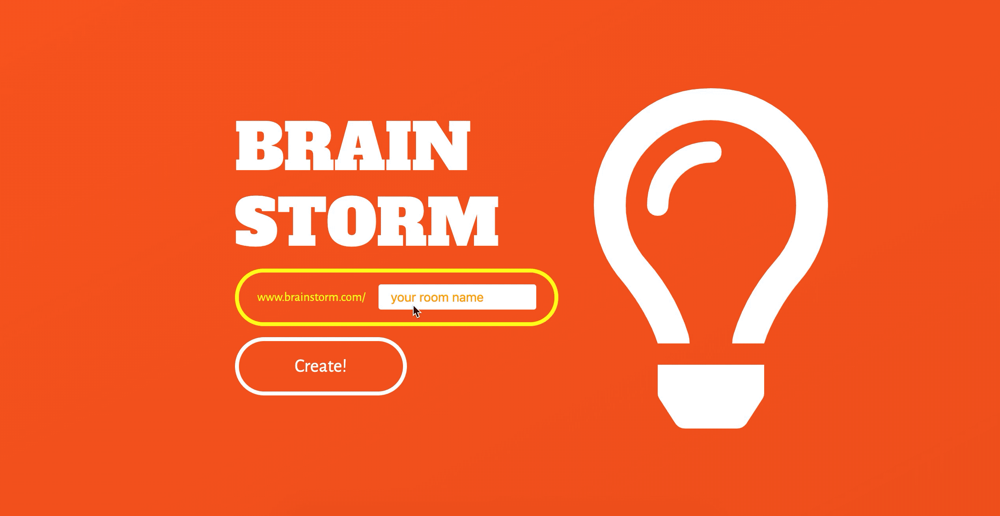

# Brain-Storm

## Introduction

BrainStorm은 실시간 아이디어 회의 애플리케이션으로서 실시간 포스트잇 생성, 수정, 삭제를 통해 아이디어 공유가 가능한 클립보드를 웹으로 제작.


## **Requirements**

- Chrome Browser를 권장합니다.


## **Features**

- 방 만들기
- 초대하기(url 공유)
- 포스트잇 생성, value 값 수정, 삭제
- Decoration menu: FontSize, BackgroundColor 수정, 사진 첨부 기능
- 포스트잇 정보 변경 DB 저장

(방만들기)


(포스트잇 생성, 수정)


## **Installation**

**Client & Server**

```
git clone https://github.com/backpack91/BrainStorm.git
cd BrainStorm
npm install
npm start
```


## **Skills**

### **1.Frontend-Side**

- Modern Javascript(ES2015+)

- React를 사용한 컴포넌트 기반의 구조

- Redux.js를 사용하여 Application State 관리

- Sass를 사용한 Nesting Style CSS

- HTTP Client 라이브러리는 Axios 사용

- Socket.io Client를 이용하여 실시간 포스트잇 정보 전달 구현

### **2.Backend-Side**

- Modern Javascript(ES2015+)
- Node.js
- Express.js
- AWS S3를 사용하여 포스트잇 첨부 이미지 저장
- MongoDB / M-Lab / Mongoose 을 사용하여 Postits 자료 저장
- Socket.io를 이용하여 실시간 포스트잇 정보 전달 구현


## **Test**

- Jest와 Enzyme을 이용하여 Component 단위 테스트 구현


## **Version Control**

- Git과 Github을 사용하여 빠르고 효과적으로 Version Control
- Trello를 사용한 Schedule Managing


## **Deployment**

- AWS Elastic Beanstalk(Api Server)


## **Challenges**

- Socket.io 라이브러리를 처음으로 다뤄보았기 때문에 개념을 이해하고 활용하는데 시간이 많이 할애했습니다
- 생성된 방에서 사용하는 포스트잇의 데이터양이 많지 않을 것으로 판단하여 포스트잇 정보를 비정규화하여 저장했습니다. 그로 인해 이전에 하던 DB 작업보다 세부적인 쿼리를 다뤄야 해서 MongoDB 문서를 더 자세히 들여다 보는 계기가 되었습니다
- 포스트잇 Style, Value, Location등의 정보가 수정됨에 따라 계속해서 DB정보 업데이트를 위한 Ajax 요청이 보내지기 때문에 프로그램이 너무 무거워지는 문제가 발생함


## **Things to do**

- Video 첨부
- 포스트잇 스티커 첨부 기능
- PDF 저장 기능
- Ajax 요청 Debounce 함수로 요청 횟수 제한 처리


------

Special Thanks to [Ken Huh](https://github.com/ken123777 "ken huh")
